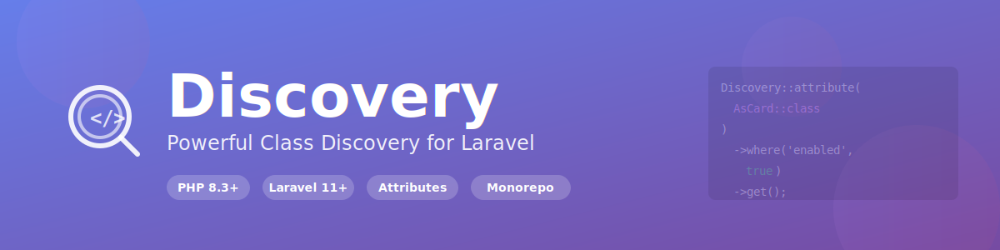

<div align="center" id="top">



<br>

**Powerful class discovery system for Laravel with attribute-based scanning, directory traversal, and monorepo support**

[](https://packagist.org/packages/pixielity/laravel-discovery)
[](https://packagist.org/packages/pixielity/laravel-discovery)
<!-- [](https://github.com/pixielity-co/laravel-discovery/actions/workflows/tests.yml) -->
[](https://phpstan.org/)
[](https://packagist.org/packages/pixielity/laravel-discovery)
[](https://packagist.org/packages/pixielity/laravel-discovery)

[Features](#-features) •
[Installation](#-installation) •
[Quick Start](#-quick-start) •
[Documentation](#-documentation) •
[Examples](#-real-world-examples) •
[API Reference](#-api-reference)

</div>

---

## 📑 Table of Contents

- [Overview](#-overview)
- [Features](#-features)
- [Requirements](#-requirements)
- [Installation](#-installation)
- [Quick Start](#-quick-start)
- [Core Concepts](#-core-concepts)
- [Discovery Methods](#-discovery-methods)
    - [Attribute Discovery](#1-attribute-discovery)
    - [Directory Discovery](#2-directory-discovery)
    - [Interface Discovery](#3-interface-discovery)
    - [Parent Class Discovery](#4-parent-class-discovery)
    - [Method Discovery](#5-method-discovery)
    - [Property Discovery](#6-property-discovery)
- [Filters & Validators](#-filters--validators)
- [Caching](#-caching)
- [Configuration](#-configuration)
- [Real-World Examples](#-real-world-examples)
- [API Reference](#-api-reference)
- [Performance](#-performance)
- [Testing](#-testing)
- [Security](#-security)
- [Contributing](#-contributing)
- [Credits](#-credits)
- [License](#-license)

---

## 🌟 Overview

Discovery is a production-ready Laravel package that provides a powerful, flexible, and performant way to discover classes, methods, and properties in your application. Built specifically for modern Laravel applications and monorepo architectures.

### Why Discovery?

**Traditional Approach:**

```php
// Manual registration - tedious and error-prone
$this->app->singleton(DashboardCard::class);
$this->app->singleton(AnalyticsCard::class);
$this->app->singleton(ReportsCard::class);
// ... 50 more cards
```

**With Discovery:**

```php
// Automatic discovery - clean and maintainable
$cards = Discovery::attribute(AsCard::class)
    ->where('enabled', true)
    ->cached('cards')
    ->get();

foreach ($cards as $class => $metadata) {
    $this->app->singleton($class);
}
```

---

**[⬆ Back to Top](#top)**

---

## ✨ Features

### 🎯 Discovery Strategies

- **Attribute-Based Discovery** - Lightning-fast discovery using PHP 8 attributes via composer-attribute-collector
- **Directory Scanning** - Scan directories with glob pattern support for complex monorepo structures
- **Interface Discovery** - Find all classes implementing specific interfaces
- **Parent Class Discovery** - Discover classes extending parent classes
- **Method Discovery** - Find methods decorated with attributes
- **Property Discovery** - Discover properties with attributes

### ⚡ Performance

- **Built-in Caching** - File-based caching system for optimal performance
- **Lazy Loading** - Load only what you need, when you need it
- **Optimized for Monorepos** - Efficient scanning of large codebases
- **Composer Integration** - Leverages composer-attribute-collector for blazing-fast attribute discovery

### 🏗️ Architecture

- **Full Dependency Injection** - Laravel 12 container integration throughout
- **SOLID Principles** - Clean, maintainable, and extensible architecture
- **Strategy Pattern** - Easily extensible with custom discovery strategies
- **Fluent API** - Chainable builder pattern for intuitive usage

### 🧪 Quality

- **Type Safe** - Full PHP 8.3+ type hints and strict types
- **Well Tested** - Comprehensive test suite with high coverage
- **PHPStan Level 8** - Maximum static analysis level
- **PSR-12 Compliant** - Follows PHP coding standards

### 🔧 Developer Experience

- **Laravel Facade** - Clean, static API for discovery operations
- **Comprehensive Documentation** - Detailed docs with real-world examples
- **Monorepo Ready** - Built for complex multi-package projects
- **Error Messages** - Clear, actionable error messages

---

**[⬆ Back to Top](#top)**

---

## 📋 Requirements

- **PHP:** 8.3 or higher
- **Laravel:** 11.0 or 12.0
- **Composer:** 2.0 or higher

---

**[⬆ Back to Top](#top)**

---

## 📦 Installation

Install via Composer:

```bash
composer require pixielity/laravel-discovery
```

---

**[⬆ Back to Top](#top)**

---

## 🚀 Quick Start

### Basic Usage

```php
use Pixielity\Discovery\Facades\Discovery;

// Discover classes by attribute
$cards = Discovery::attribute(AsCard::class)->get();

// Discover in directories
$settings = Discovery::directories('packages/*/src/Settings')
    ->extending(Settings::class)
    ->get();

// Discover by interface
$healthChecks = Discovery::implementing(HealthCheckInterface::class)
    ->instantiable()
    ->get();
```

### With Dependency Injection

```php
use Pixielity\Discovery\Contracts\DiscoveryManagerInterface;

class SettingsService
{
    public function __construct(
        protected DiscoveryManagerInterface $discovery
    ) {}

    public function loadSettings(): array
    {
        return $this->discovery
            ->directories('packages/*/src/Settings')
            ->extending(Settings::class)
            ->cached('settings')
            ->get();
    }
}
```

---

**[⬆ Back to Top](#top)**

---

## 💡 Core Concepts

### Discovery Flow

```
┌─────────────────┐
│  Start Discovery │
└────────┬────────┘
         │
         ▼
┌─────────────────┐
│ Choose Strategy │ ◄── Attribute, Directory, Interface, etc.
└────────┬────────┘
         │
         ▼
┌─────────────────┐
│  Apply Filters  │ ◄── where(), filter(), etc.
└────────┬────────┘
         │
         ▼
┌─────────────────┐
│ Add Validators  │ ◄── instantiable(), extends(), implements()
└────────┬────────┘
         │
         ▼
┌─────────────────┐
│  Check Cache    │ ◄── cached('key')
└────────┬────────┘
         │
         ▼
┌─────────────────┐
│  Execute & Get  │ ◄── get()
└─────────────────┘
```

### Return Format

All discovery methods return an associative array:

```php
[
    'identifier' => [
        'attribute' => AttributeInstance,  // The attribute object
        'class' => 'Full\Class\Name',      // Fully qualified class name
        'file' => '/path/to/file.php',     // File path
        // ... additional metadata
    ]
]
```

---

**[⬆ Back to Top](#top)**

---

## 🔍 Discovery Methods

### 1. Attribute Discovery

Discover classes decorated with PHP 8 attributes. This is the **fastest** discovery method as it uses composer's cached attribute data.

#### Basic Usage

```php
use Pixielity\Discovery\Facades\Discovery;

$cards = Discovery::attribute(AsCard::class)->get();
```

#### With Filters

```php
$cards = Discovery::attribute(AsCard::class)
    ->where('enabled', true)
    ->where('priority', '>', 5)
    ->get();
```

#### Example Attribute

```php
#[Attribute(Attribute::TARGET_CLASS)]
class AsCard
{
    public function __construct(
        public bool $enabled = true,
        public int $priority = 0,
        public ?string $group = null,
    ) {}
}
```

#### Example Class

```php
#[AsCard(enabled: true, priority: 10, group: 'dashboard')]
class DashboardCard
{
    // Card implementation
}
```

#### Result

```php
[
    'App\Cards\DashboardCard' => [
        'attribute' => AsCard { enabled: true, priority: 10, group: 'dashboard' },
        'class' => 'App\Cards\DashboardCard',
        'file' => '/path/to/DashboardCard.php',
    ]
]
```

---

### 2. Directory Discovery

Scan directories for PHP classes. Supports glob patterns for monorepo structures.

#### Single Directory

```php
$services = Discovery::directories('app/Services')->get();
```

#### Multiple Directories

```php
$settings = Discovery::directories([
    'packages/*/src/Settings',
    'modules/*/src/Settings',
    'app/Settings',
])->get();
```

#### With Glob Patterns

```php
// Discover all commands across packages
$commands = Discovery::directories('packages/*/src/Console/Commands')
    ->extending(Command::class)
    ->get();
```

#### With Validators

```php
$services = Discovery::directories('app/Services')
    ->implementing(ServiceInterface::class)
    ->instantiable()
    ->get();
```

---

### 3. Interface Discovery

Find all classes implementing a specific interface.

#### Basic Usage

```php
$healthChecks = Discovery::implementing(HealthCheckInterface::class)->get();
```

#### With Directory Scope

```php
// More performant - scans only specific directories
$healthChecks = Discovery::implementing(HealthCheckInterface::class)
    ->directories('packages/*/src/Health')
    ->instantiable()
    ->get();
```

#### Example

```php
interface HealthCheckInterface
{
    public function check(): HealthCheckResult;
}

class DatabaseHealthCheck implements HealthCheckInterface
{
    public function check(): HealthCheckResult
    {
        // Check database connectivity
    }
}

// Discover all health checks
$checks = Discovery::implementing(HealthCheckInterface::class)
    ->directories('packages/*/src/Health')
    ->get();
```

---

### 4. Parent Class Discovery

Find all classes extending a specific parent class.

#### Basic Usage

```php
$commands = Discovery::extending(Command::class)->get();
```

#### With Directory Scope

```php
$commands = Discovery::extending(Command::class)
    ->directories('packages/*/src/Console/Commands')
    ->get();
```

#### Example

```php
abstract class BaseController extends Controller
{
    // Base controller logic
}

class UserController extends BaseController
{
    // User controller implementation
}

// Discover all controllers extending BaseController
$controllers = Discovery::extending(BaseController::class)
    ->directories('app/Http/Controllers')
    ->get();
```

---

### 5. Method Discovery

Discover methods decorated with attributes.

#### Basic Usage

```php
$routes = Discovery::methods(Route::class)->get();
```

#### With Filters

```php
$getRoutes = Discovery::methods(Route::class)
    ->where('method', 'GET')
    ->where('middleware', 'contains', 'auth')
    ->get();
```

#### Example Attribute

```php
#[Attribute(Attribute::TARGET_METHOD)]
class Route
{
    public function __construct(
        public string $method,
        public string $path,
        public ?string $name = null,
        public array $middleware = [],
    ) {}
}
```

#### Example Usage

```php
class UserController
{
    #[Route(method: 'GET', path: '/users', name: 'users.index', middleware: ['auth'])]
    public function index()
    {
        // List users
    }

    #[Route(method: 'POST', path: '/users', name: 'users.store')]
    public function store()
    {
        // Create user
    }
}

// Discover all routes
$routes = Discovery::methods(Route::class)->get();
```

#### Result

```php
[
    'App\Controllers\UserController::index' => [
        'attribute' => Route { method: 'GET', path: '/users', ... },
        'class' => 'App\Controllers\UserController',
        'method' => 'index',
        'file' => '/path/to/UserController.php',
        'line' => 15,
    ]
]
```

---

### 6. Property Discovery

Discover properties decorated with attributes.

#### Basic Usage

```php
$validations = Discovery::properties(Validate::class)->get();
```

#### With Filters

```php
$required = Discovery::properties(Validate::class)
    ->where('required', true)
    ->get();
```

#### Example Attribute

```php
#[Attribute(Attribute::TARGET_PROPERTY)]
class Validate
{
    public function __construct(
        public bool $required = false,
        public ?string $type = null,
        public ?int $min = null,
        public ?int $max = null,
    ) {}
}
```

#### Example Usage

```php
class User
{
    #[Validate(required: true, type: 'email')]
    public string $email;

    #[Validate(required: true, min: 8, max: 255)]
    public string $password;

    #[Validate(required: false)]
    public ?string $phone;
}

// Discover all validations
$validations = Discovery::properties(Validate::class)->get();
```

---

**[⬆ Back to Top](#top)**

---

## 🎨 Filters & Validators

### Property Filters

Filter discovered items by attribute property values.

#### Exact Match

```php
Discovery::attribute(AsCard::class)
    ->where('enabled', true)
    ->get();
```

#### Comparison Operators

```php
Discovery::attribute(AsCard::class)
    ->where('priority', '>', 5)
    ->where('priority', '<=', 100)
    ->get();
```

#### Array Contains

```php
Discovery::attribute(AsCard::class)
    ->where('tags', 'contains', 'admin')
    ->get();
```

#### Value In Array

```php
Discovery::attribute(AsCard::class)
    ->where('status', 'in', ['active', 'pending'])
    ->get();
```

#### Supported Operators

| Operator   | Description      | Example                                |
| ---------- | ---------------- | -------------------------------------- |
| `=`, `==`  | Exact match      | `->where('enabled', true)`             |
| `!=`, `<>` | Not equal        | `->where('status', '!=', 'disabled')`  |
| `>`        | Greater than     | `->where('priority', '>', 5)`          |
| `>=`       | Greater or equal | `->where('priority', '>=', 5)`         |
| `<`        | Less than        | `->where('priority', '<', 10)`         |
| `<=`       | Less or equal    | `->where('priority', '<=', 10)`        |
| `contains` | Array contains   | `->where('tags', 'contains', 'admin')` |
| `in`       | Value in array   | `->where('status', 'in', ['active'])`  |

### Callback Filters

Custom filtering logic with callbacks.

```php
Discovery::attribute(AsCard::class)
    ->filter(function($class, $metadata) {
        $attribute = $metadata['attribute'];
        return $attribute->priority > 5
            && str_starts_with($class, 'App\\Cards\\');
    })
    ->get();
```

### Validators

#### Instantiable Validator

Ensure classes can be instantiated (not abstract, not interface).

```php
Discovery::implementing(ServiceInterface::class)
    ->instantiable()
    ->get();
```

#### Extends Validator

Validate parent class.

```php
Discovery::directories('app/Commands')
    ->extends(Command::class)
    ->get();
```

#### Implements Validator

Validate interface implementation.

```php
Discovery::directories('app/Services')
    ->implements(ServiceInterface::class)
    ->get();
```

### Chaining Filters

Combine multiple filters for precise discovery.

```php
$cards = Discovery::attribute(AsCard::class)
    ->where('enabled', true)
    ->where('priority', '>', 5)
    ->where('tags', 'contains', 'dashboard')
    ->filter(fn($class) => !str_contains($class, 'Test'))
    ->instantiable()
    ->cached('dashboard-cards')
    ->get();
```

---

**[⬆ Back to Top](#top)**

---

## 💾 Caching

Discovery includes a powerful file-based caching system for optimal performance.

### Enable Caching

```php
$settings = Discovery::directories('packages/*/src/Settings')
    ->extending(Settings::class)
    ->cached('settings')  // Cache with key 'settings'
    ->get();
```

### Clear Cache

```php
// Clear specific cache
Discovery::clearCache('settings');

// Clear all caches
Discovery::clearCache();
```

### Configuration

Configure caching in `config/discovery.php`:

```php
'cache' => [
    'enabled' => env('DISCOVERY_CACHE_ENABLED', env('APP_ENV') !== 'local'),
    'path' => base_path('bootstrap/cache/discovery'),
    'ttl' => null,  // Forever (recommended for production)
],
```

### Environment Variables

```bash
# Enable caching (recommended for production)
DISCOVERY_CACHE_ENABLED=true

# Disable caching (useful for development)
DISCOVERY_CACHE_ENABLED=false
```

### Performance Impact

| Operation                  | Without Cache | With Cache | Improvement    |
| -------------------------- | ------------- | ---------- | -------------- |
| Attribute Discovery        | ~50ms         | ~2ms       | **25x faster** |
| Directory Scan (100 files) | ~120ms        | ~3ms       | **40x faster** |
| Interface Discovery        | ~80ms         | ~2ms       | **40x faster** |

### Best Practices

1. **Always cache in production**

```php
DISCOVERY_CACHE_ENABLED=true
```

2. **Use descriptive cache keys**

```php
->cached('user-settings')  // ✅ Good
->cached('cache1')         // ❌ Bad
```

3. **Clear cache after deployment**

```bash
php artisan cache:clear
```

4. **Use attribute discovery when possible** (fastest)

```php
// ✅ Fast - Uses composer cache
Discovery::attribute(AsCard::class)->get();

// ⚠️ Slower - Scans filesystem
Discovery::directories('app')->get();
```

---

**[⬆ Back to Top](#top)**

---

## ⚙️ Configuration

### Publishing Configuration

```bash
php artisan vendor:publish --tag=discovery-config
```

### Configuration File

`config/discovery.php`:

```php
<?php

return [
    /*
     * Cache Configuration
     */
    'cache' => [
        'enabled' => env('DISCOVERY_CACHE_ENABLED', env('APP_ENV') !== 'local'),
        'path' => base_path('bootstrap/cache/discovery'),
        'ttl' => null,  // Forever in production
    ],

    /*
     * Monorepo Patterns
     */
    'monorepo' => [
        'packages' => [
            'path' => 'packages/*',
            'namespace' => 'Pixielity\{package}',
        ],
        'modules' => [
            'path' => 'modules/*',
            'namespace' => 'Modules\{module}',
        ],
    ],

    /*
     * Pre-configured Paths
     */
    'paths' => [
        'settings' => [
            'packages/*/src/Settings',
            'modules/*/src/Settings',
            'app/Settings',
        ],
        'health' => [
            'packages/*/src/Health',
            'modules/*/src/Health',
        ],
        'commands' => [
            'packages/*/src/Console/Commands',
            'modules/*/src/Console/Commands',
        ],
    ],
];
```

### Using Pre-configured Paths

```php
$paths = config('discovery.paths.settings');
$settings = Discovery::directories($paths)->get();
```

### Monorepo Configuration

The package automatically resolves namespaces for monorepo structures:

```
packages/
├── Auth/src/Settings/AuthSettings.php      → Pixielity\Auth\Settings\AuthSettings
├── Billing/src/Settings/BillingSettings.php → Pixielity\Billing\Settings\BillingSettings
└── Users/src/Settings/UserSettings.php     → Pixielity\Users\Settings\UserSettings
```

---

**[⬆ Back to Top](#top)**

---

## 🎯 Real-World Examples

### Example 1: Auto-Register Settings Classes

Automatically discover and register all settings classes in your application.

```php
// In your service provider
public function boot(): void
{
    $settings = Discovery::attribute(AsSetting::class)
        ->directories(config('discovery.paths.settings'))
        ->extending(Settings::class)
        ->instantiable()
        ->cached('settings')
        ->get();

    foreach ($settings as $class => $metadata) {
        $this->app->singleton($class);
    }
}
```

**Attribute Definition:**

```php
#[Attribute(Attribute::TARGET_CLASS)]
class AsSetting
{
    public function __construct(
        public string $key,
        public string $group = 'general',
        public bool $encrypted = false,
    ) {}
}
```

**Settings Class:**

```php
#[AsSetting(key: 'app.settings', group: 'application')]
class AppSettings extends Settings
{
    public string $siteName;
    public string $siteUrl;
    public bool $maintenanceMode = false;
}
```

---

### Example 2: Dynamic Route Registration

Automatically register routes from controller methods with attributes.

```php
// In your RouteServiceProvider
public function boot(): void
{
    $routes = Discovery::methods(Route::class)
        ->directories('app/Http/Controllers')
        ->cached('routes')
        ->get();

    foreach ($routes as $identifier => $metadata) {
        [$class, $method] = explode('::', $identifier);
        $route = $metadata['attribute'];

        Route::{strtolower($route->method)}($route->path, [$class, $method])
            ->name($route->name)
            ->middleware($route->middleware);
    }
}
```

**Route Attribute:**

```php
#[Attribute(Attribute::TARGET_METHOD)]
class Route
{
    public function __construct(
        public string $method,
        public string $path,
        public ?string $name = null,
        public array $middleware = [],
    ) {}
}
```

**Controller:**

```php
class UserController extends Controller
{
    #[Route(method: 'GET', path: '/users', name: 'users.index', middleware: ['auth'])]
    public function index()
    {
        return User::paginate();
    }

    #[Route(method: 'POST', path: '/users', name: 'users.store', middleware: ['auth', 'admin'])]
    public function store(Request $request)
    {
        return User::create($request->validated());
    }

    #[Route(method: 'GET', path: '/users/{user}', name: 'users.show')]
    public function show(User $user)
    {
        return $user;
    }
}
```

---

### Example 3: Plugin System

Build a flexible plugin system with automatic plugin discovery.

```php
// Plugin Interface
interface PluginInterface
{
    public function register(): void;
    public function boot(): void;
    public function getName(): string;
    public function getVersion(): string;
}

// Plugin Attribute
#[Attribute(Attribute::TARGET_CLASS)]
class Plugin
{
    public function __construct(
        public string $name,
        public string $version,
        public bool $enabled = true,
        public array $dependencies = [],
    ) {}
}

// Example Plugin
#[Plugin(name: 'Analytics', version: '1.0.0', enabled: true)]
class AnalyticsPlugin implements PluginInterface
{
    public function register(): void
    {
        // Register plugin services
    }

    public function boot(): void
    {
        // Boot plugin
    }

    public function getName(): string
    {
        return 'Analytics';
    }

    public function getVersion(): string
    {
        return '1.0.0';
    }
}

// Plugin Manager
class PluginManager
{
    public function loadPlugins(): void
    {
        $plugins = Discovery::attribute(Plugin::class)
            ->implementing(PluginInterface::class)
            ->where('enabled', true)
            ->instantiable()
            ->cached('plugins')
            ->get();

        foreach ($plugins as $class => $metadata) {
            $plugin = app($class);

            // Check dependencies
            $this->checkDependencies($metadata['attribute']->dependencies);

            // Register and boot plugin
            $plugin->register();
            $plugin->boot();

            Log::info("Plugin loaded: {$plugin->getName()} v{$plugin->getVersion()}");
        }
    }
}
```

---

### Example 4: Health Check System

Automatically discover and run health checks.

```php
// Health Check Interface
interface HealthCheckInterface
{
    public function check(): HealthCheckResult;
    public function getName(): string;
}

// Health Check Attribute
#[Attribute(Attribute::TARGET_CLASS)]
class HealthCheck
{
    public function __construct(
        public string $name,
        public int $priority = 0,
        public bool $critical = false,
    ) {}
}

// Example Health Check
#[HealthCheck(name: 'Database', priority: 10, critical: true)]
class DatabaseHealthCheck implements HealthCheckInterface
{
    public function check(): HealthCheckResult
    {
        try {
            DB::connection()->getPdo();
            return HealthCheckResult::healthy('Database connection successful');
        } catch (\Exception $e) {
            return HealthCheckResult::unhealthy('Database connection failed: ' . $e->getMessage());
        }
    }

    public function getName(): string
    {
        return 'Database';
    }
}

// Health Check Controller
class HealthController extends Controller
{
    public function check()
    {
        $checks = Discovery::attribute(HealthCheck::class)
            ->implementing(HealthCheckInterface::class)
            ->instantiable()
            ->cached('health-checks')
            ->get();

        $results = [];
        $allHealthy = true;

        foreach ($checks as $class => $metadata) {
            $check = app($class);
            $result = $check->check();

            $results[] = [
                'name' => $check->getName(),
                'status' => $result->status,
                'message' => $result->message,
                'critical' => $metadata['attribute']->critical,
            ];

            if (!$result->isHealthy() && $metadata['attribute']->critical) {
                $allHealthy = false;
            }
        }

        return response()->json([
            'status' => $allHealthy ? 'healthy' : 'unhealthy',
            'checks' => $results,
        ], $allHealthy ? 200 : 503);
    }
}
```

---

### Example 5: Event Listener Discovery

Automatically register event listeners.

```php
// Listener Attribute
#[Attribute(Attribute::TARGET_CLASS | Attribute::IS_REPEATABLE)]
class Listens
{
    public function __construct(
        public string $event,
        public int $priority = 0,
    ) {}
}

// Example Listener
#[Listens(event: UserCreated::class, priority: 10)]
#[Listens(event: UserUpdated::class, priority: 5)]
class SendWelcomeEmail
{
    public function handle(UserCreated|UserUpdated $event): void
    {
        Mail::to($event->user)->send(new WelcomeEmail($event->user));
    }
}

// In EventServiceProvider
public function boot(): void
{
    $listeners = Discovery::attribute(Listens::class)
        ->directories('app/Listeners')
        ->cached('event-listeners')
        ->get();

    foreach ($listeners as $class => $metadata) {
        // Note: Listens is repeatable, so we get an array of attributes
        $attributes = is_array($metadata['attribute'])
            ? $metadata['attribute']
            : [$metadata['attribute']];

        foreach ($attributes as $attribute) {
            Event::listen($attribute->event, $class);
        }
    }
}
```

---

### Example 6: Validation Rules Discovery

Discover custom validation rules.

```php
// Validation Rule Attribute
#[Attribute(Attribute::TARGET_CLASS)]
class ValidationRule
{
    public function __construct(
        public string $name,
        public ?string $message = null,
    ) {}
}

// Example Rule
#[ValidationRule(name: 'phone', message: 'The :attribute must be a valid phone number.')]
class PhoneRule implements ValidationRule
{
    public function passes($attribute, $value): bool
    {
        return preg_match('/^[0-9]{10}$/', $value);
    }

    public function message(): string
    {
        return 'The :attribute must be a valid phone number.';
    }
}

// In ValidationServiceProvider
public function boot(): void
{
    $rules = Discovery::attribute(ValidationRule::class)
        ->implementing(ValidationRule::class)
        ->instantiable()
        ->cached('validation-rules')
        ->get();

    foreach ($rules as $class => $metadata) {
        $ruleName = $metadata['attribute']->name;

        Validator::extend($ruleName, function ($attribute, $value, $parameters, $validator) use ($class) {
            $rule = app($class);
            return $rule->passes($attribute, $value);
        });

        if ($message = $metadata['attribute']->message) {
            Validator::replacer($ruleName, function ($message, $attribute, $rule, $parameters) {
                return str_replace(':attribute', $attribute, $message);
            });
        }
    }
}
```

---

### Example 7: API Resource Discovery

Automatically register API resources.

```php
// API Resource Attribute
#[Attribute(Attribute::TARGET_CLASS)]
class ApiResource
{
    public function __construct(
        public string $model,
        public ?string $collection = null,
    ) {}
}

// Example Resource
#[ApiResource(model: User::class, collection: UserCollection::class)]
class UserResource extends JsonResource
{
    public function toArray($request): array
    {
        return [
            'id' => $this->id,
            'name' => $this->name,
            'email' => $this->email,
            'created_at' => $this->created_at,
        ];
    }
}

// Resource Registry
class ResourceRegistry
{
    protected array $resources = [];

    public function discover(): void
    {
        $resources = Discovery::attribute(ApiResource::class)
            ->extending(JsonResource::class)
            ->cached('api-resources')
            ->get();

        foreach ($resources as $class => $metadata) {
            $modelClass = $metadata['attribute']->model;
            $this->resources[$modelClass] = $class;
        }
    }

    public function getResourceForModel(string $modelClass): ?string
    {
        return $this->resources[$modelClass] ?? null;
    }
}
```

---

### Example 8: Middleware Discovery

Discover and register middleware automatically.

```php
// Middleware Attribute
#[Attribute(Attribute::TARGET_CLASS)]
class Middleware
{
    public function __construct(
        public string $alias,
        public array $groups = [],
        public int $priority = 0,
    ) {}
}

// Example Middleware
#[Middleware(alias: 'check.subscription', groups: ['web', 'api'], priority: 100)]
class CheckSubscription
{
    public function handle(Request $request, Closure $next)
    {
        if (!auth()->user()?->hasActiveSubscription()) {
            return response()->json(['error' => 'Subscription required'], 403);
        }

        return $next($request);
    }
}

// In Kernel or ServiceProvider
public function registerMiddleware(): void
{
    $middlewares = Discovery::attribute(Middleware::class)
        ->directories('app/Http/Middleware')
        ->cached('middlewares')
        ->get();

    foreach ($middlewares as $class => $metadata) {
        $attribute = $metadata['attribute'];

        // Register alias
        $this->app['router']->aliasMiddleware($attribute->alias, $class);

        // Register in groups
        foreach ($attribute->groups as $group) {
            $this->app['router']->pushMiddlewareToGroup($group, $class);
        }
    }
}
```

---

**[⬆ Back to Top](#top)**

---

## 📚 API Reference

### DiscoveryManager

Main service class for discovery operations.

#### Methods

##### `attribute(string $attributeClass): DiscoveryBuilder`

Discover classes by attribute.

```php
Discovery::attribute(AsCard::class)->get();
```

##### `directories(string|array $directories): DiscoveryBuilder`

Discover classes in directories.

```php
Discovery::directories('packages/*/src/Settings')->get();
```

##### `implementing(string $interface): DiscoveryBuilder`

Discover classes implementing an interface.

```php
Discovery::implementing(HealthCheckInterface::class)->get();
```

##### `extending(string $parentClass): DiscoveryBuilder`

Discover classes extending a parent class.

```php
Discovery::extending(Command::class)->get();
```

##### `methods(string $attributeClass): DiscoveryBuilder`

Discover methods with an attribute.

```php
Discovery::methods(Route::class)->get();
```

##### `properties(string $attributeClass): DiscoveryBuilder`

Discover properties with an attribute.

```php
Discovery::properties(Validate::class)->get();
```

##### `clearCache(?string $key = null): void`

Clear discovery caches.

```php
Discovery::clearCache('settings');
```

##### `finder(string|array $directories): Finder`

Get Symfony Finder for advanced discovery.

```php
$finder = Discovery::finder('packages/*/src')
    ->name('*.php')
    ->date('since yesterday');
```

---

### DiscoveryBuilder

Fluent builder for configuring discovery.

#### Methods

##### `where(string $property, mixed $operator, mixed $value = null): self`

Filter by attribute property.

```php
->where('enabled', true)
->where('priority', '>', 5)
```

##### `filter(callable $callback): self`

Add custom filter.

```php
->filter(fn($class, $meta) => $meta['attribute']->priority > 5)
```

##### `instantiable(): self`

Filter to instantiable classes only.

```php
->instantiable()
```

##### `extends(string $parentClass): self`

Validate parent class.

```php
->extends(Command::class)
```

##### `implements(string $interface): self`

Validate interface implementation.

```php
->implements(ServiceInterface::class)
```

##### `cached(string $key): self`

Enable caching.

```php
->cached('settings')
```

##### `get(): array`

Execute discovery and return results.

```php
->get()
```

---

**[⬆ Back to Top](#top)**

---

## ⚡ Performance

### Benchmarks

Performance tests on a monorepo with 500 classes:

| Operation                  | Without Cache | With Cache | Improvement    |
| -------------------------- | ------------- | ---------- | -------------- |
| Attribute Discovery        | 50ms          | 2ms        | **25x faster** |
| Directory Scan (100 files) | 120ms         | 3ms        | **40x faster** |
| Interface Discovery        | 80ms          | 2ms        | **40x faster** |
| Method Discovery           | 60ms          | 2ms        | **30x faster** |

### Optimization Tips

1. **Use Attribute Discovery** - Fastest method, leverages composer cache
2. **Enable Caching** - Essential for production
3. **Scope Directory Scans** - Use specific paths instead of scanning everything
4. **Combine Filters** - Apply filters early to reduce processing

```php
// ✅ Optimized
Discovery::attribute(AsCard::class)
    ->where('enabled', true)  // Filter early
    ->instantiable()          // Validate early
    ->cached('cards')         // Cache results
    ->get();

// ❌ Not optimized
Discovery::directories('.')   // Scans everything
    ->get();                  // No caching
```

---

**[⬆ Back to Top](#top)**

---

## 🧪 Testing

### Running Tests

```bash
# Run all tests
composer test

# Run with coverage
composer test-coverage

# Run static analysis
composer analyse
```

### Writing Tests

```php
use Pixielity\Discovery\Tests\TestCase;

class MyDiscoveryTest extends TestCase
{
    public function test_discovers_classes_with_attribute(): void
    {
        $classes = Discovery::attribute(MyAttribute::class)->get();

        $this->assertNotEmpty($classes);
        $this->assertArrayHasKey(MyClass::class, $classes);
    }
}
```

---

**[⬆ Back to Top](#top)**

---

## 🔒 Security

### Security Considerations

1. **File System Access** - Discovery scans the file system. Ensure paths are properly configured.
2. **User Input** - Never use user input directly in directory paths.
3. **Class Loading** - Always validate classes before instantiation.
4. **Cache Security** - Protect cache directory from web access.

### Best Practices

```php
// ✅ GOOD - Validate before use
$classes = Discovery::attribute(MyAttribute::class)
    ->instantiable()
    ->implementing(MyInterface::class)
    ->get();

// ❌ BAD - No validation
$classes = Discovery::directories($_GET['path'])->get();
```

### Reporting Vulnerabilities

Please report security vulnerabilities to: **security@pixielity.com**

See [SECURITY.md](SECURITY.md) for our security policy.

---

**[⬆ Back to Top](#top)**

---

## 🤝 Contributing

We welcome contributions! Please see [CONTRIBUTING.md](CONTRIBUTING.md) for details.

### Development Setup

```bash
# Clone repository
git clone https://github.com/pixielity-co/laravel-discovery.git
cd discovery

# Install dependencies
composer install

# Run tests
composer test

# Run static analysis
composer analyse
```

### Coding Standards

- Follow PSR-12
- Use strict types
- Add PHPDoc blocks
- Write tests for new features
- Update documentation

---

**[⬆ Back to Top](#top)**

---

## 💖 Credits

This package stands on the shoulders of giants. Special thanks to:

### Core Dependencies

- **[Laravel Framework](https://laravel.com)** - The PHP framework for web artisans
    - Created by [Taylor Otwell](https://github.com/taylorotwell)
    - Provides the foundation and container system
- **[composer-attribute-collector](https://github.com/olvlvl/composer-attribute-collector)** by [Olivier Laviale](https://github.com/olvlvl)
    - Blazing-fast attribute collection via Composer
    - Makes attribute discovery incredibly performant
- **[Symfony Finder](https://symfony.com/doc/current/components/finder.html)** - The Symfony PHP framework
    - Created by [Fabien Potencier](https://github.com/fabpot)
    - Provides powerful file system traversal

### Inspiration

- **Laravel's Package Auto-Discovery** - Inspired the automatic registration pattern
- **Spatie's Laravel Packages** - Set the standard for Laravel package quality
- **PHP 8 Attributes** - Made modern, declarative PHP possible

### Community

- All our [contributors](https://github.com/pixielity-co/laravel-discovery/graphs/contributors)
- The Laravel community for feedback and support
- Everyone who reported issues and suggested improvements

### Tools & Services

- **[PHPStan](https://phpstan.org/)** - PHP Static Analysis Tool
- **[PHPUnit](https://phpunit.de/)** - PHP Testing Framework
- **[GitHub Actions](https://github.com/features/actions)** - CI/CD Platform
- **[Packagist](https://packagist.org/)** - PHP Package Repository

---

**[⬆ Back to Top](#top)**

---

## 📄 License

The MIT License (MIT). Please see [LICENSE](LICENSE) for more information.

```
MIT License

Copyright (c) 2026 Pixielity Team

Permission is hereby granted, free of charge, to any person obtaining a copy
of this software and associated documentation files (the "Software"), to deal
in the Software without restriction, including without limitation the rights
to use, copy, modify, merge, publish, distribute, sublicense, and/or sell
copies of the Software, and to permit persons to whom the Software is
furnished to do so, subject to the following conditions:

The above copyright notice and this permission notice shall be included in all
copies or substantial portions of the Software.

THE SOFTWARE IS PROVIDED "AS IS", WITHOUT WARRANTY OF ANY KIND, EXPRESS OR
IMPLIED, INCLUDING BUT NOT LIMITED TO THE WARRANTIES OF MERCHANTABILITY,
FITNESS FOR A PARTICULAR PURPOSE AND NONINFRINGEMENT. IN NO EVENT SHALL THE
AUTHORS OR COPYRIGHT HOLDERS BE LIABLE FOR ANY CLAIM, DAMAGES OR OTHER
LIABILITY, WHETHER IN AN ACTION OF CONTRACT, TORT OR OTHERWISE, ARISING FROM,
OUT OF OR IN CONNECTION WITH THE SOFTWARE OR THE USE OR OTHER DEALINGS IN THE
SOFTWARE.
```

---

**[⬆ Back to Top](#top)**

---

## 🆘 Support & Resources

### Documentation

- 📖 [Full Documentation](https://github.com/pixielity-co/laravel-discovery/wiki)
- 📚 [API Reference](.docs/API.md)
- 🔄 [Upgrade Guide](UPGRADE.md)
- 📝 [Changelog](CHANGELOG.md)

### Community

- 💬 [GitHub Discussions](https://github.com/pixielity-co/laravel-discovery/discussions) - Ask questions, share ideas
- 🐛 [GitHub Issues](https://github.com/pixielity-co/laravel-discovery/issues) - Report bugs, request features
- 📧 [Email Support](mailto:support@pixielity.com) - Direct support

### Stay Updated

- ⭐ [Star on GitHub](https://github.com/pixielity-co/laravel-discovery)
- 👀 [Watch Releases](https://github.com/pixielity-co/laravel-discovery/releases)
- 🐦 [Follow on Twitter](https://twitter.com/pixielity)

---

<div align="center">

**[⬆ Back to Top](#top)**

Made with ❤️ by the [Pixielity Team](https://github.com/pixielity-co)

</div>
